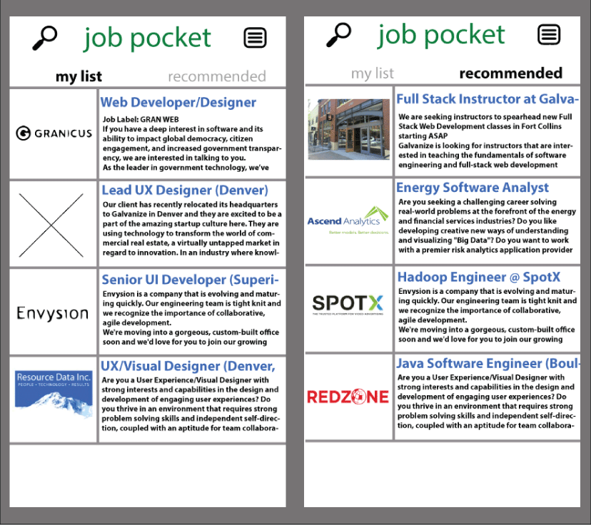

#JOB POCKET

##Description
This app, will allow job seekers to store job postings off of any site with a url that doesn't require a login to view. As a job seeker, you may come across various job postings that you would like to save and view at a later time. This app will allow you to take that url and email that url to your Job Pocket App. In addition this app will have a recommendation newsfeed section based off scraping jobs on craigslist. In the recommendation section you will have an area to enter key words that will narrow down the job recommendations.

##Features
- Time Stamp

##Technologies
- MEAN Stack
  - NodeJS
  - ExpressJS back-end - utilize mostly RESTful routes that serve JSON
  - Angular front-end
  - MongoDB (along with Mongoose or Monk)
- Gulp
- PassportJS for Authentication
- Bootstrap
- TDD
- Cheerio

##Stretch Goals
- Add Favorite Lists
- Add More search parameters

##Other
- RSS Feed- xml - grab - parse (once a day)
- Hacker News (whos hiring)
- Angular Directives templates
- Prevent duplicate Urls
- skeleton
- Import.io

##References
- http://rss-tutorial.com/index.php
- http://techcrunch.com/2014/02/18/kimono-is-a-smarter-web-scraper-that-lets-you-api-ify-the-web-no-code-required/
- https://www.quora.com/How-do-Pocket-app-Instapaper-Flipboard-etc-extract-articles-from-a-page
-  
